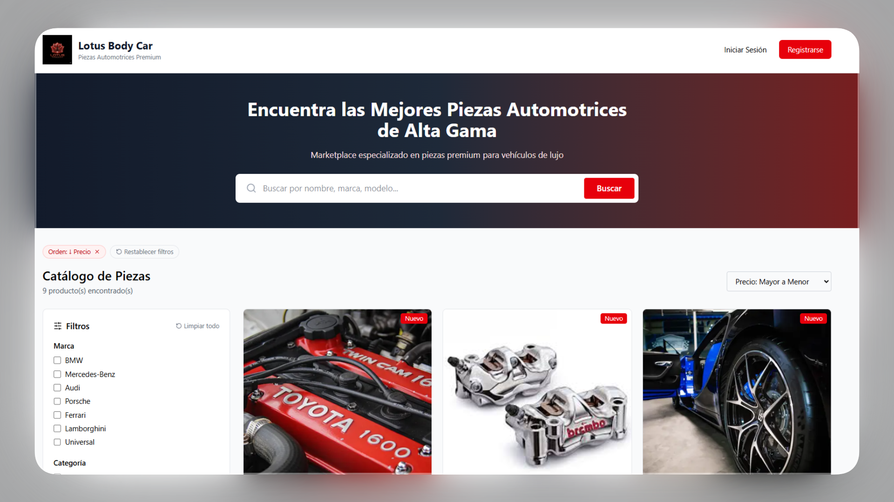

# Lotus Body Car - Professional Auto Detailing Landing Page

This repository contains the source code for the official landing page of Lotus Body Car, a premier automotive detailing and aesthetic center. The site is designed to showcase high-end vehicle care services, providing a professional digital presence for car enthusiasts and clients seeking premium maintenance.

# Live Site
https://lotus-body-car.vercel.app/

# About the Project
Lotus Body Car specializes in professional vehicle restoration and protection. This website serves as a portfolio and service catalog, allowing clients to explore specialized detailing treatments, view high-quality results, and book appointments for their vehicles.

# Core Areas of Expertise:

Aesthetic Detailing: Deep interior and exterior cleaning using specialized techniques to restore a "showroom" finish.

Paint Correction: Removal of swirls, scratches, and oxidation to enhance the depth and clarity of the vehicle's paint.

Ceramic Coating: Application of advanced nanotechnology layers for long-lasting protection against UV rays, chemicals, and contaminants.

Upholstery Care: Deep cleaning and conditioning of leather and fabric interiors to preserve comfort and value.

Engine Cleaning: Safe and detailed cleaning of the engine bay to maintain performance visibility and aesthetics.

# Stack

Framework: Nextjs

Deployment: Vercel

Database: Supabase

Styling: TailwindCSS
